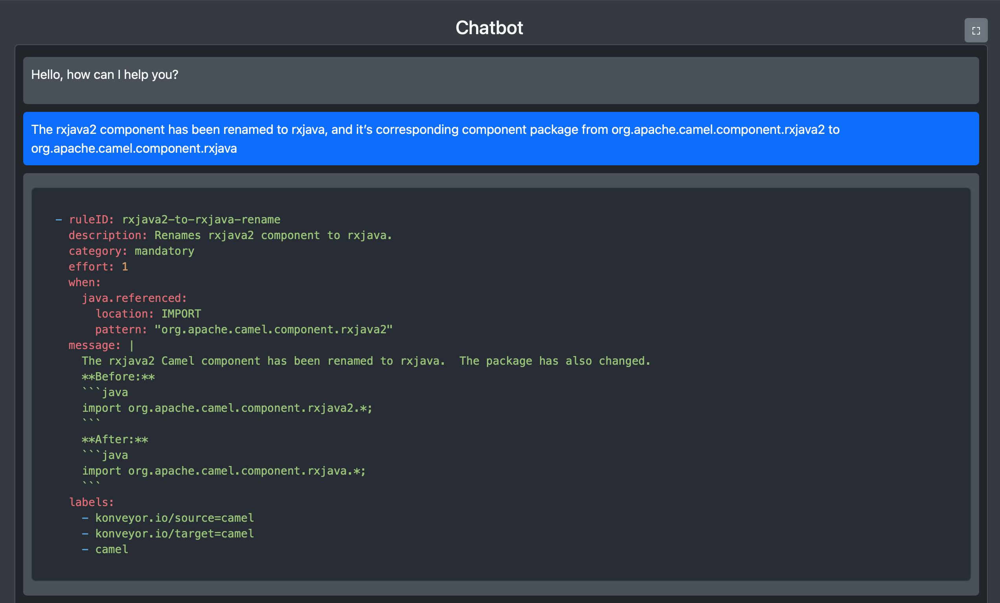

# Kantra Rules Generator

A modern web-based chatbot application that generates Konveyor Kantra migration rules for Java developers migrating applications from one framework version to another. Uses LangChain4j and Gemini AI to generate rules in real-time.



## Overview

Kantra Rules Generator is an intelligent chatbot that helps developers create migration rules for Konveyor Kantra. The application uses AI to convert natural language descriptions of code changes into properly formatted YAML rules that can be used with Kantra's migration analysis tools.

## Features

- 🤖 **AI-Powered Rule Generation**: Converts natural language to Kantra YAML rules
- 💬 **Real-time Chat Interface**: WebSocket-based chat with instant responses
- 📋 **One-Click YAML Copy**: Copy generated rules directly to clipboard
- 🎨 **Syntax Highlighting**: Beautiful YAML syntax highlighting with dark theme
- 📱 **Responsive Design**: Works on desktop and mobile devices
- 🌙 **Dark Theme**: Modern dark interface that's easy on the eyes

## Technology Stack

### Backend
- **Quarkus**: Supersonic Subatomic Java Framework
- **LangChain4j**: AI/LLM integration framework
- **WebSockets**: Real-time communication
- **Maven**: Build and dependency management

### Frontend
- **HTML5/CSS3**: Modern web standards
- **JavaScript**: Vanilla JS with ES6+ features
- **Marked.js**: Markdown parsing and rendering
- **Highlight.js**: Syntax highlighting for YAML
- **Bootstrap 5**: Responsive UI components

## Getting Started

### Prerequisites

- Java 17 or higher
- Maven 3.6+
- Gemini AI API key (for AI functionality)

### Installation

1. **Clone the repository**
   ```bash
   git clone <repository-url>
   cd kantra-rules-gen
   ```

2. **Set up environment variables**
   ```bash
   export GEMINI_AI_KEY="your-gemini-api-key-here"
   ```

3. **Run the application in development mode**
   ```bash
   ./mvnw quarkus:dev
   ```

4. **Access the application**
   Open your browser and navigate to [http://localhost:8080](http://localhost:8080)

## Usage

### Starting a Conversation

1. Click the chat button (💬) in the bottom-right corner
2. Type your migration rule request in natural language
3. The AI will generate a Kantra YAML rule for you

### Example Queries

- "The rxjava2 component has been renamed to rxjava, and its corresponding component package from org.apache.camel.component.rxjava2 to org.apache.camel.component.rxjava"
- "Replace javax.persistence.Entity with jakarta.persistence.Entity"
- "Update Spring Boot version from 2.x to 3.x"

### Copying YAML Rules

- Click the "📋 Copy YAML" button on any YAML response
- The rule will be copied to your clipboard without markdown formatting
- Paste directly into your Kantra rules file

## Project Structure

```
kantra-rules-gen/
├── src/
│   ├── main/
│   │   ├── java/dev/shaaf/kantra/rules/gen/
│   │   │   ├── ChatSocket.java          # WebSocket handler
│   │   │   └── RuleGenerator.java       # AI service interface
│   │   └── resources/
│   │       ├── META-INF/resources/      # Static web assets
│   │       │   ├── index.html           # Main web page
│   │       │   ├── websocket-chat.js    # Chat functionality
│   │       │   ├── styles.css           # Custom styling
│   │       │   └── background.jpg       # Background image
│   │       └── application.properties   # Configuration
│   └── test/                            # Test files
├── pom.xml                              # Maven configuration
└── README.md                            # This file
```

## Configuration

### Environment Variables

- `GEMINI_AI_KEY`: Your Gemini AI API key (required)

### Application Properties

The application uses Quarkus configuration in `src/main/resources/application.properties`:

```properties
quarkus.langchain4j.ai.gemini.api-key=${GEMINI_AI_KEY}
quarkus.langchain4j.gemini.chat-model.model-id=gemini-pro
```

## Development

### Running in Development Mode

```bash
./mvnw quarkus:dev
```

This starts the application in development mode with:
- Live reload on code changes
- Dev UI available at [http://localhost:8080/q/dev/](http://localhost:8080/q/dev/)
- Hot deployment

### Building for Production

```bash
# Package the application
./mvnw package

# Run the packaged application
java -jar target/quarkus-app/quarkus-run.jar
```

### Creating Native Executable

```bash
# Build native executable
./mvnw package -Dnative

# Run native executable
./target/kantra-rules-gen-1.0.0-SNAPSHOT-runner
```

## API Reference

### WebSocket Endpoint

- **Path**: `/chat/{username}`
- **Protocol**: WebSocket
- **Messages**: Text messages for chat interaction

### REST Endpoints

- **GET** `/`: Serves the main web application
- **GET** `/q/dev/`: Quarkus Dev UI (development only)

## Contributing

1. Fork the repository
2. Create a feature branch (`git checkout -b feature/amazing-feature`)
3. Commit your changes (`git commit -m 'Add amazing feature'`)
4. Push to the branch (`git push origin feature/amazing-feature`)
5. Open a Pull Request

## Acknowledgments

- [Quarkus](https://quarkus.io/) - The Supersonic Subatomic Java Framework
- [Konveyor Kantra](https://konveyor.io/kantra/) - Migration analysis tool
- [LangChain4j](https://github.com/langchain4j/langchain4j) - Java framework for LLM applications
- [Gemini AI](https://ai.google.dev/) - AI model provider

